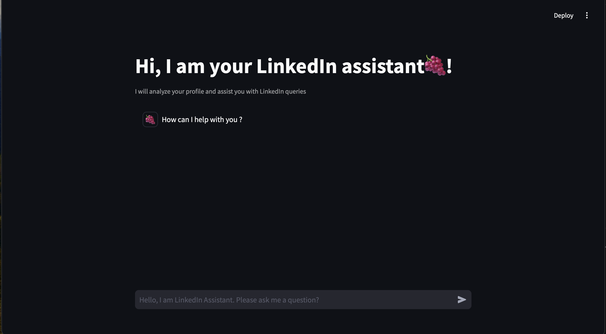

# Grapevine LinkedIn Chatbot

Grapevine is a LinkedIn chatbot assistant designed to help users analyze LinkedIn profiles and assist with queries related to their network connections. The chatbot utilizes the LinkedIn data stored in a CSV file and provides information about the connections as per user requests.



## Features
- Analyze LinkedIn profile data from a CSV file.
- Assist with user queries related to LinkedIn connections.
- Stream responses from the Groq model in real-time.

## Installation

### Prerequisites
- Python 3.12 or higher
- `pip` for managing Python packages
- Environment variables set in a `.env` file (or Streamlit secrets for deployment)

### Setup Instructions

1. **Clone the Repository**
   ```sh
   git clone https://github.com/gigialc/hack_grapevine.git
   cd hack_grapevine-main
   ```

2. **Install Dependencies**
   Create a virtual environment and activate it:
   ```sh
   python3 -m venv .venv
   source .venv/bin/activate  # For Unix systems
   .\.venv\Scripts\activate  # For Windows systems
   ```
   Install required Python packages:
   ```sh
   pip install -r requirements.txt
   ```

3. **Set Up Environment Variables**
   Create a `.env` file in the project root with the following variables:
   ```
   GROQ_API_KEY=<Your_GROQ_API_Key>
   INITIAL_RESPONSE=<Your_Initial_Response>
   INITIAL_MSG=<Your_Initial_Message>
   CHAT_CONTEXT=<Your_Chat_Context>
   ```

## Usage
To start the chatbot, run the Streamlit application:
```sh
streamlit run chatbot.py
```
This will launch a local server where you can interact with your LinkedIn assistant.

### Example Interaction
- Type in your query, such as "Looking for connections with the position of Data Scientist".
- The assistant will display the relevant profile information along with LinkedIn URLs.

## Files Included
- `chatbot.py`: Main script for running the chatbot using Streamlit and Groq.
- `Combined_Connections.csv`: Dataset of LinkedIn connections used for answering queries.
- `requirements.txt`: Dependencies for running the project.

## requirements.txt
```
streamlit
pandas
python-dotenv
groq-sdk
```


## License
This project is licensed under the MIT License.

## Acknowledgments
- Special thanks to the Groq team for providing the API integration.

## Issues and Contributions
Feel free to submit issues and contribute to the project by forking the repository and creating pull requests.
